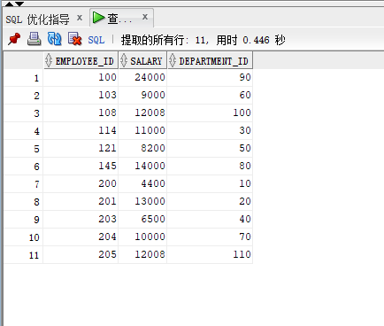

# 实验1：SQL语句的执行计划分析与优化指导

### 实验目的

    分析SQL执行计划，执行SQL语句的优化指导。理解分析SQL语句的执行计划的重要作用。
### 实验内容
```
对Oracle12c中的HR人力资源管理系统中的表进行查询与分析。
首先运行和分析教材中的样例：本训练任务目的是查询两个部门('IT'和'Sales')的部门总人数和平均工资，以下两个查询的结果是一样的。但效率不相同。
设计自己的查询语句，并作相应的分析，查询语句不能太简单。
```
### 教材中的查询语句
- 查询1：


```
set autotrace on

SELECT d.department_name,count(e.job_id)as "部门总人数",
avg(e.salary)as "平均工资"
from hr.departments d,hr.employees e
where d.department_id = e.department_id
and d.department_name in ('IT','Sales')
GROUP BY d.department_name;
```


- 查询2：

```
set autotrace on

SELECT d.department_name,count(e.job_id)as "部门总人数",
avg(e.salary)as "平均工资"
FROM hr.departments d,hr.employees e
WHERE d.department_id = e.department_id
GROUP BY d.department_name
HAVING d.department_name in ('IT','Sales');
```


### 比较两个语句的效率

- 最优的SQL语句通过sqldeveloper的优化指导工具进行优化指导，看看该工具有没有给出优化建议：
- 分析：
  - 第一个
  - 第二个
  - physical reads代表从磁盘读取的block的数量；consistent gets代表从buffer cache中读取的undo数据的block数量。physical reads和consistent gets通常是效率比较的关键。physical reads很高时，要从磁盘请求大量的数据到buffer cache里面，会影响数据库的性能，因此physical reads越小越好，对比两个查询语句的physical reads，两者值相同，无法进行比较。consistent gets可以简单的理解为，最终的结果集，所获取的块数，所以第一个的consistent gets比第二个小，因此，第一个的效率更好。


### 设计自己的查询语句

- 查询每个部门薪水最高的人的id,薪水,和部门

```
set autotrace on
SELECT e.employee_id,e.salary,e.department_id
FROM (SELECT department_id,max(e.salary) m FROM hr.employees e
GROUP BY e.department_id) t,hr.employees e WHERE e.department_id
= t.department_id and t.m = e.salary
```

- 运行结果：



- 给出优化建议结果：


### 实验总结：

